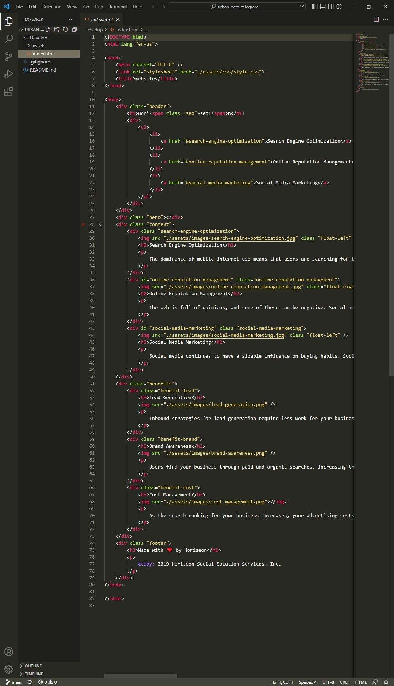
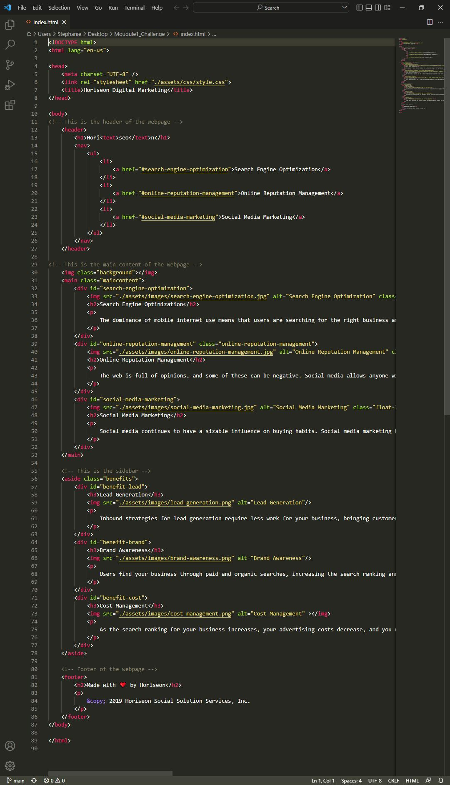
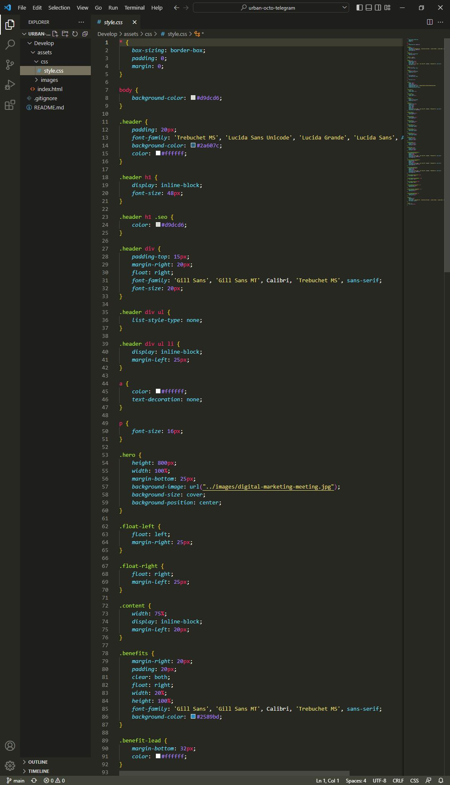
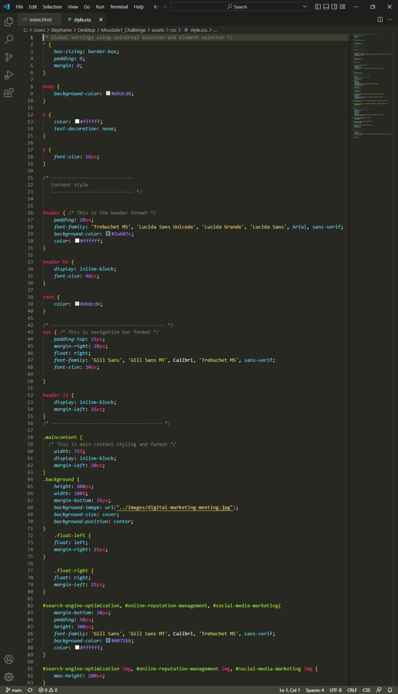

# Module 1 Challenge

## Objective:
* Refactor the starter code to meet HTML and CSS accessibility standard.
* The application is supposed to functioning as same as the original webpage provided. 

## Changes made to the HTML:

* Semantic elements were used to replace some of the non-sematic elements.
* The structure were modified according to the order of elements shown in the webpage.
* Simplified the elements so less code were used for the same function.
* Comments were added to make the codes more readable. 

See screenshots for more details:

  
  
   
  Original HTML codes &emsp;&emsp;&emsp;&emsp;&emsp;&emsp;&emsp;&emsp;&emsp;&emsp;&emsp;&emsp; Refactored HTML codes

## Changes made to the CSS:

* The structure were modified according to the order of elements shown in the webpage.
* Used multi-class selectors to combine different elements with same styling.
* Comments were added to make the codes more readable. 

See screenshots for more details:

  
  
   
  Original CSS codes &emsp;&emsp;&emsp;&emsp;&emsp;&emsp;&emsp;&emsp;&emsp;&emsp;&emsp;&emsp; Refactored CSS codes

## The Outcome

With the changes made above, the webpage is functing as same as before. See screenshots as reference:

 
Original Webpage
 
  
 
Refactored Webpage

## Installation

The project was uploaded to [github](https://github.com/) repository. You can get access from: [https://github.com/RicenUdonLover/Module_1_Challenge_Lian_Liu](https://github.com/RicenUdonLover/Module_1_Challenge_Lian_Liu).
 
You can also see the deployed webpage at: [https://ricenudonlover.github.io/Module_1_Challenge_Lian_Liu/](https://ricenudonlover.github.io/Module_1_Challenge_Lian_Liu/)
