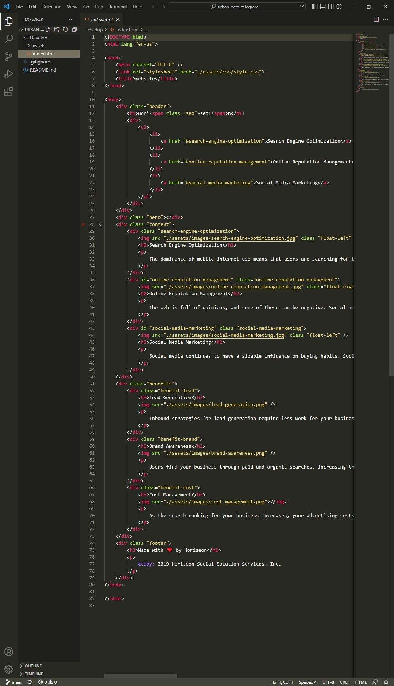
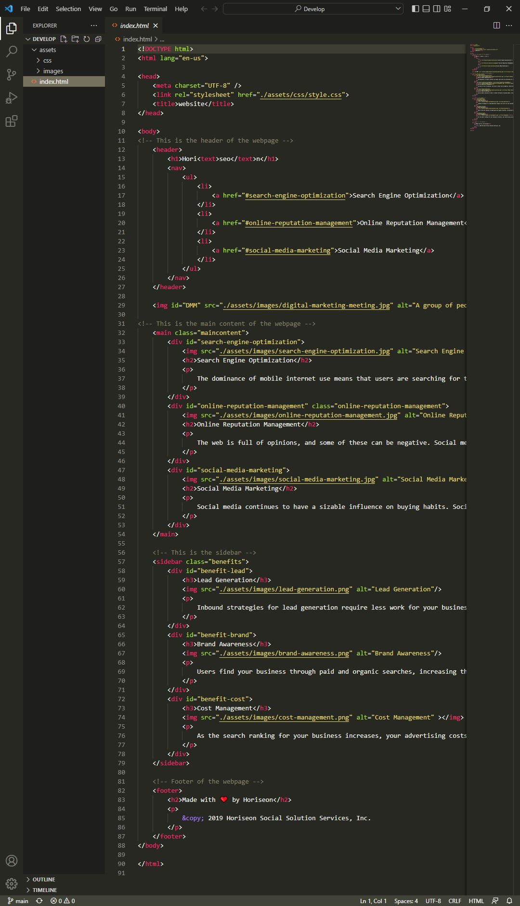

# Module 1 Challenge

## Objective:
* Refactor the starter code to meet HTML and CSS accessibility standard.
* The application is supposed to functioning as same as the original webpage provided. 

## Changes made to the HTML:

* Semantic elements were used to replace some of the non-sematic elements.
* The structure were modified according to the order of elements shown in the webpage.
* Simplified the elements so less code were used for the same function.
* Comments were added to make the codes more readable. 

  display: inline-block
  
  

